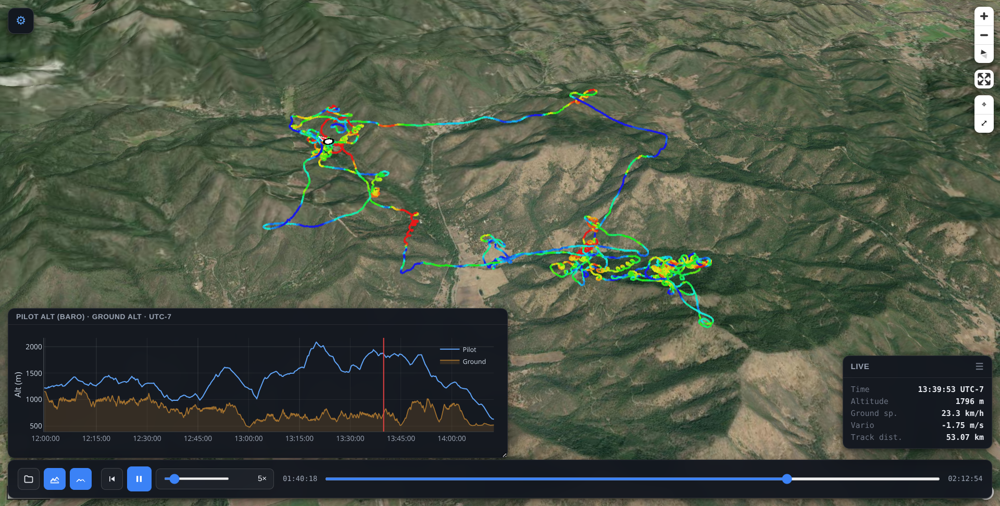

# Flight Viewer

A single-file, standalone 3-D flight viewer for paragliding / hang-gliding
tracks. Open `flight_viewer.html` in any modern browser, drop in an `.igc`,
`.gpx`, or `.kml` file, and fly the track over real 3-D terrain with
vario-coloured trail, ground-altitude chart, draggable HUD, and full
playback control. No build step, no server, no account.

## Screenshots

Landing screen — waiting for a file:

Loaded flight — full GUI:

## Quick start

1. Open `flight_viewer.html` in any modern browser (Chrome, Edge, Firefox,
   Safari ≥ 16). Internet access is required (see [Online requirement](#online-requirement)).
2. Drag a flight file onto the window, or click **Open** in the bottom bar.
3. Press space to play / pause, scroll the timeline to scrub, or click the
   chart to seek to a specific time.

The HTML contains zero embedded flight data — every open viewer starts on
the landing screen and waits for user input. Loading a new file always
loads cleanly over the previous one.

## Online requirement

`flight_viewer.html` is self-contained code, but it streams the following
resources from public CDNs and tile providers on first open and as you pan
around:

| Resource | Source | Purpose |
|----------|--------|---------|
| MapLibre GL JS 4.7 | `unpkg.com` | Map rendering engine |
| deck.gl 9.0 | `unpkg.com` | Track / pilot overlays, interleaved with MapLibre |
| Plotly 2.35 | `cdn.plot.ly` | Altitude / ground chart |
| `tz-lookup` 6.1 | `unpkg.com` | Coord → IANA timezone (used for DST-correct local time) |
| World Imagery (satellite basemap) | `services.arcgisonline.com` (Esri) | Visible map tiles |
| OpenStreetMap (street basemap) | `tile.openstreetmap.org` | Alternative map tiles |
| Terrarium DEM (3-D terrain + chart's ground line) | `s3.amazonaws.com/elevation-tiles-prod/terrarium/` (Mapzen / AWS Open Data, CC0) | Elevation, sampled directly at zoom 14 (~10 m / pixel) for ridge-accurate ground-altitude readouts |

If you open the viewer with no internet access, the map area will be blank
and the chart's ground trace will be empty. The track itself, the
playback, the HUD, and the spline geometry still work because they're
computed from the loaded `.igc` / `.gpx` / `.kml` alone. Timezone display
falls back to a longitude-only UTC offset (no DST) when `tz-lookup`
cannot load.

## Features

### Map and terrain
- Satellite (Esri World Imagery) or OSM street basemap, toggle in the
  drawer.
- Real 3-D terrain from the Mapzen / AWS **Terrarium** DEM, with
  adjustable exaggeration (1× – 3×, default 1×).
- Standard pan / rotate / pitch / zoom. **Swap L/R mouse** (on by
  default): left-drag rotates the 3-D view, right-drag pans — better
  for touchpads. Turn off to restore MapLibre's left-pan / right-rotate
  layout. Middle-wheel zoom is unchanged.
- Slower default scroll / trackpad zoom rates; map **+ / −** controls
  use instant zoom steps so they still work while **Follow pilot** is on
  (animated zoom would be cancelled by per-frame recentering).

### Track
- Cubic Hermite spline through the original IGC fixes — the recorded
  points are never moved, only the connecting curve is smoothed. A
  separate **Curve strength** slider (0 – 3×) controls how much the
  spline bows between fixes, so thermal spirals stay round instead of
  collapsing into chord polylines.
- Per-vertex **vario colouring** (red = climb, blue = sink, green ≈ 0),
  with adjustable max climb / sink (default ±2 m/s), or **single
  colour** (default pure green).
- Adjustable pixel width (`Track width`) and optional metres-wide 3-D
  ribbon (`3-D thickness`) so the track reads as a solid body from any
  angle.
- The trail **ends exactly under the pilot marker** — the boundary
  fix-to-fix segment is re-sampled along the spline each frame so there
  is no overshoot, even on low-rate IGCs.
- **Track-ahead toggle** in the bottom bar: hides the unflown portion
  by default; click to show the full track at full opacity.
- **Track fade** slider (settings): seconds of fully-bright trail
  behind the pilot before fading to transparent. `0` = off (whole past
  stays bright). Step auto-scales to ~10 % of the current value; max
  stretches to the full flight duration.

### Spiral reconstruction
- **Model overlay** for thermal spirals. At 1 Hz sampling, a paraglider
  rotating faster than 0.5 turns/sec aliases into a zig-zag that no simple
  spline can recover.
- Synthesizes a smooth helix that passes *exactly* through every original
  GPS fix, using a sliding centroid to capture actual terrain-relative drift.
- **Auto mode**: detects spirals based on a continuous heading change threshold.
- **Manual mode**: lets you define the exact time window of a spiral.
- **Turns / sec**: slider to set the expected rotation rate, resolving the
  hidden integer turns between 1 Hz samples.

### Pilot marker
- Three shapes (settings **Pilot shape**):
  - **Cylinder** (default) — 3-D extruded marker: white inner puck,
    magenta outer annulus band, and red forward wedge. Opaque matte
    finish; constant on-screen pixel size at any zoom via `mPerPx`
    scaling (same scheme as Arrow / Wing).
  - **Arrow** — flat black-ringed disc with a triangular nose, always
    drawn on top of the track.
  - **Wing** — elongated ellipse canopy perpendicular to flight
    direction.
- **Pilot size** slider: 0.1 – 1× (default 0.5×).
- Heading follows the *smoothed* spline tangent, so the nose / wedge
  tracks the curve even during rapid thermal turns.

### Camera
- **Follow pilot** is **on by default** after load. The map recentres on
  the live marker every frame using an analytical ground-offset model
  (stable at high pitch, no pan-by oscillation).
- While following: **right-click drag** orbits around the pilot,
  **wheel / trackpad** zooms around the pilot, and **left-click** (or
  pan drag, depending on swap setting) exits follow. Toggle follow in
  settings, with the **⊕** map control, or **`C`**.
- **Fit track** (`R`) or the **Fit** button: top-down view containing
  the whole track (fitBounds is only reliable at pitch 0). Temporarily
  turns follow off. Manual Fit uses generous padding; the **opening
  view** uses a tighter fit plus a little extra zoom, then eases to
  65° pitch and re-enables follow.
- **Takeoff** button flies to the launch with a 3-D tilt and starts
  playback from the first fix.
- **Center on pilot** (`C` / ⊕) toggles follow mode (not a one-shot
  recenter).

### Chart
- Single toggle in the bottom bar shows both **Pilot altitude** (blue,
  GPS or baro, includes the user's Alt offset) and **Ground altitude**
  (earth-brown, with a soft fill) on the same y-axis. The visible gap
  is AGL.
- Ground altitude is fetched directly from Terrarium tiles at zoom 14
  (~10 m / pixel) — independent of the camera state, so ridge tops
  aren't undersampled the way they are with the map's render-time DEM.
- Y-axis range = **union** of pilot and ground extents, so the ground
  line stays in frame even when terrain rises above the pilot's path.
- X-axis is rendered in the **launch site's local clock time** with
  DST applied via `tz-lookup` + `Intl.DateTimeFormat`. Falls back to a
  longitude-only UTC offset when `tz-lookup` is unavailable.
- Click anywhere on the chart to seek; the cursor line shows the
  current playback time.
- Draggable header, resizable corner.

### HUD
- Live time (launch-local, DST-aware), altitude, ground speed, vario,
  cumulative distance.
- Draggable anywhere on screen.

### Playback
- Play / pause with `Space`, restart, scrub via the timeline.
- Speed control 0.1× – 120×: drag the small slider, scroll the wheel
  (1 step / Shift = 10 steps), single-click the readout to cycle
  common presets (0.5 / 1 / 2 / 5 / 10 / 30 / 60 / 120×),
  double-click the readout to reset to 1×.
- Current and total time both shown in `HH:MM:SS`.
- Bottom playback bar is fully draggable.

### Settings drawer
Altitude source (GPS vs baro), units (metric / imperial), Alt offset
(slider + numeric box; lines up takeoff with the DEM), Terrain exag,
Track width, Track fade, 3-D thickness, Color mode + max climb / sink,
Smoothing subdivisions, Curve strength, Spiral reconstruction (On/Off, Mode,
Turns / sec, Detect threshold, Manual range), Pilot shape, Pilot size,
Follow pilot, Swap L/R mouse, Map style. Camera row: **Takeoff** and
**Fit** shortcuts.

Universal slider ergonomics: double-click any slider to reset to its
default; mouse-wheel nudges by `step` (Shift = ×10, Ctrl = ×100).

## Keyboard shortcuts

| Key | Action |
|-----|--------|
| `Space` | Play / pause |
| `←` / `→` | Step backward / forward (Shift = bigger step) |
| `R` | Fit track (top-down) |
| `C` | Toggle follow pilot |
| `F` | Toggle map fullscreen |
| `O` | Open another file |
| `S` | Toggle the settings drawer |
| `Esc` | Exit fullscreen |

## Supported file formats

| Format | Notes |
|--------|-------|
| `.igc` | IGC paragliding / sailplane fixes (B records). GPS and baro altitude both supported. |
| `.gpx` | Standard `<trkpt>` track-points, with elevation. |
| `.kml` | Google Earth-style `<gx:Track>` / `<LineString>`. |

## Privacy

Flight files are processed entirely in the browser. They never leave
your machine; the viewer's only network traffic is the basemap / DEM /
library requests listed in [Online requirement](#online-requirement).

## Browser support

Tested on recent Chrome, Edge, Firefox and Safari. WebGL 2 required.
Tablets work; the bottom playback bar is touch-aware.

## Performance notes

- Spline geometry is cached; only colour / alpha attributes update each
  frame. The per-frame fade and the dynamic trail-tip are essentially
  free.
- DEM ground-altitude sampling buckets fixes by tile so each Terrarium
  tile is fetched once and decoded once; a typical XC flight covers
  ~10 – 50 unique tiles (~500 KB – 2.5 MB total, downloaded in
  parallel and progressively painted into the chart).

## Credits

- Map rendering: [MapLibre GL JS](https://maplibre.org/) (BSD 3-Clause)
- Overlays: [deck.gl](https://deck.gl/) (MIT)
- Charts: [Plotly.js](https://plotly.com/javascript/) (MIT)
- Timezone lookup: [tz-lookup](https://github.com/darkskyapp/tz-lookup-oss) (CC0, archived 2020; viewer loads v6.1.25 from `unpkg.com`)
- Satellite basemap: © Esri World Imagery
- Street basemap: © OpenStreetMap contributors
- Terrain DEM: Mapzen / AWS Open Data Terrarium tiles (CC0)

## License

Released under the [MIT License](LICENSE). © 2026 skywalker1905.
