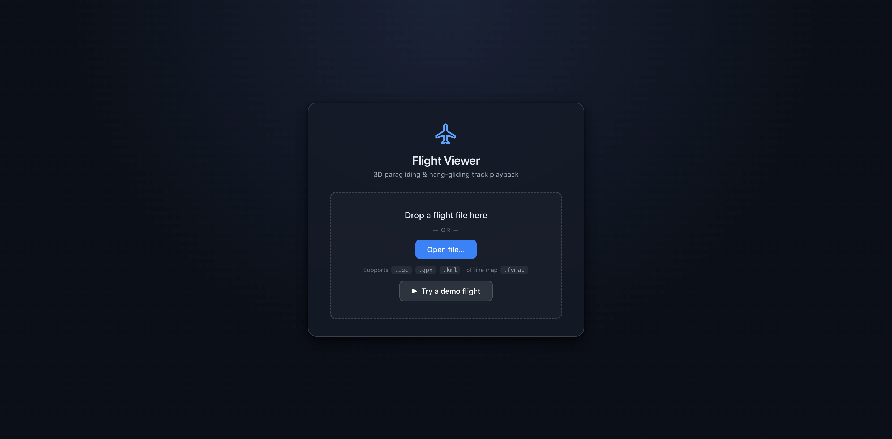

# Flight Viewer

A single-file, standalone 3-D flight viewer for paragliding / hang-gliding
tracks. Open `flight_viewer.html` in any modern browser, drop in an `.igc`,
`.gpx`, or `.kml` file, and fly the track over real 3-D terrain with
vario-coloured trail, altitude / vario / speed charts, flight statistics
with XC scoring, thermal detection and wind estimation, live HUD
(including AGL and glide ratio), and full playback control. A cinematic
**Director camera** auto-frames the whole flight; a **thermal.kk7.ch
thermal & skyways heatmap** overlays the terrain; multiple tracks replay
side-by-side; you can draw and share **launch / landing sites**, load
**OpenAir / openAIP airspace**, and download **offline map packs** for
flying in the field. Settings, sites and the active offline map persist
locally. No build step, no server, no account.

**Try it online:**
<https://skywalker1905.github.io/paragliding_flight_3D_viewer/> — hit
**Try a demo flight**, drop in your own file, or click **Explore thermal
map** to browse the thermal / skyways heatmaps with no flight loaded.
Nothing is uploaded; all processing stays in your browser.

## Screenshots

Landing screen — waiting for a file:

Loaded flight — full GUI:

## Quick start

1. Open `flight_viewer.html` in any modern browser (Chrome, Edge, Firefox,
   Safari ≥ 16). Internet access is required (see [Online requirement](#online-requirement)).
2. Drag a flight file onto the window, or click **Open** in the bottom bar.
3. Press space to play / pause, scrub the timeline (hover for a time
   bubble), drag on the chart, or press `?` for all keyboard shortcuts.

The HTML contains zero embedded flight data — every open viewer starts on
the landing screen and waits for user input. Loading a new file always
loads cleanly over the previous one. Flights you load are remembered in
the browser's local IndexedDB and offered as one-tap **Recent flights**
on the landing screen (local only, never uploaded).

## Online requirement

`flight_viewer.html` is self-contained code, but it streams the following
resources from public CDNs and tile providers on first open and as you pan
around:

| Resource | Source | Purpose |
|----------|--------|---------|
| MapLibre GL JS 4.7 | `unpkg.com` | Map rendering engine |
| deck.gl 9.0 | `unpkg.com` | Track / pilot overlays, interleaved with MapLibre |
| Plotly 2.35 | `cdn.plot.ly` | Altitude / ground chart |
| `tz-lookup` 6.1 | `unpkg.com` | Coord → IANA timezone (used for DST-correct local time) |
| World Imagery (satellite basemap) | `services.arcgisonline.com` (Esri) | Visible map tiles |
| OpenStreetMap (street basemap) | `tile.openstreetmap.org` | Alternative map tiles |
| Terrarium DEM (3-D terrain + chart's ground line) | `s3.amazonaws.com/elevation-tiles-prod/terrarium/` (Mapzen / AWS Open Data, CC0) | Elevation, sampled directly at zoom 14 (~10 m / pixel) for ridge-accurate ground-altitude readouts |
| Thermal & skyways heatmaps | `thermal.kk7.ch` (CC-BY-NC-SA) | Optional thermal-probability / flight-density overlay |
| openAIP airspace tiles | `api.tiles.openaip.net` | Optional worldwide airspace overlay (needs a free API key) |
| Label glyphs | `demotiles.maplibre.org` | Fonts for the launch / landing site labels |
| Reverse geocoding | `nominatim.openstreetmap.org` | Names offline-map packs after their region (falls back to coordinates) |

If you open the viewer with no internet access, the map area will be blank
and the chart's ground trace will be empty. The track itself, the
playback, the HUD, and the spline geometry still work because they're
computed from the loaded `.igc` / `.gpx` / `.kml` alone. Timezone display
falls back to a longitude-only UTC offset (no DST) when `tz-lookup`
cannot load.

To replay a specific flight with **no network at all**, pre-download its
map with settings → **Offline map** while online and load the resulting
`.fvmap` file next time (see [Offline maps](#offline-maps)). Note the
JS libraries themselves still come from CDNs, so the browser must have
cached them or have been opened online at least once.

## Features

### Map and terrain
- Satellite (Esri World Imagery) or OSM street basemap, toggle in the
  drawer.
- Real 3-D terrain from the Mapzen / AWS **Terrarium** DEM, with
  adjustable exaggeration (1× – 3×, default 1×).
- Standard pan / rotate / pitch / zoom. By default **left-drag rotates**
  the 3-D view and right-drag pans — better for touchpads. The **Swap L/R
  mouse** setting flips this to left-pan / right-rotate. Middle-wheel zoom
  is unchanged.
- Slower default scroll / trackpad zoom rates; map **+ / −** controls
  use instant zoom steps so they still work while **Follow pilot** is on
  (animated zoom would be cancelled by per-frame recentering).

### Track
- **Centripetal Catmull-Rom spline** (α = 0.5, Barry–Goldman evaluation
  in a local metre frame) through the original IGC fixes — the recorded
  points are never moved, only the connecting curve is smoothed. The
  centripetal parameterisation is overshoot- and cusp-free by
  construction, so thermal circles and long glides both come out fair
  with nothing to tune. A **Rounding** slider (0 – 100 %) blends between
  raw chords and the full spline.
- Per-vertex **vario colouring** (red = climb, blue = sink, green ≈ 0),
  with adjustable max climb / sink (default ±2 m/s), or **single
  colour** (default pure green).
- Adjustable pixel width (`Track width`) and optional metres-wide 3-D
  ribbon (`3-D thickness`) so the track reads as a solid body from any
  angle.
- The trail **ends exactly under the pilot marker** — the boundary
  fix-to-fix segment is re-sampled along the spline each frame so there
  is no overshoot, even on low-rate IGCs.
- **Track curtain** (settings, on by default): translucent pale wall from
  the track down to the terrain — a strong 3-D depth cue, SeeYou-style.
- **Track-ahead toggle** in the bottom bar: hides the unflown portion
  by default; click to show the full track at full opacity.
- **Independent track & curtain fade** (settings → Trail & pilot): the
  vario line and the curtain each have their own on/off switch plus a
  **hold** time (seconds the flown stretch stays fully bright behind the
  pilot) and a **fade** time (seconds it then takes to fade to
  transparent). The four sliders stay live and persist even while a
  group's fade is off. Defaults: track fade **off**; curtain fade **on**
  (1:00 hold, 1:00 fade).

### Spiral reconstruction
- **Model overlay** for thermal spirals. At 1 Hz sampling, a paraglider
  rotating faster than 0.5 turns/sec aliases into a zig-zag that no simple
  spline can recover.
- Synthesizes a smooth helix that passes *exactly* through every original
  GPS fix, using a sliding centroid to capture actual terrain-relative drift.
- **Auto mode**: detects spirals based on a continuous heading change threshold.
- **Manual mode**: lets you define the exact time window of a spiral.
- **Turns / sec**: slider to set the expected rotation rate, resolving the
  hidden integer turns between 1 Hz samples.

### Pilot marker
- Three shapes (settings **Pilot shape**):
  - **Cylinder** (default) — 3-D extruded marker: white inner puck,
    magenta outer annulus band, and red forward wedge. Opaque matte
    finish; constant on-screen pixel size at any zoom via `mPerPx`
    scaling (same scheme as Arrow / Wing).
  - **Arrow** — flat black-ringed disc with a triangular nose, always
    drawn on top of the track.
  - **Wing** — elongated ellipse canopy perpendicular to flight
    direction.
- **Pilot size** slider: 0.1 – 1× (default 0.5×).
- **Altitude line** (on by default): a thin vertical line from the pilot
  down to the terrain plus a soft shadow disc at its foot. Both are
  depth-tested (they hide behind ridges), so height above ground reads
  at a glance in the 3-D view.
- Heading follows the *smoothed* spline tangent, so the nose / wedge
  tracks the curve even during rapid thermal turns.

### Camera
- **Follow pilot** is **on by default** after load. The map recentres on
  the live marker every frame using an analytical ground-offset model
  (stable at high pitch, no pan-by oscillation).
- While following: **right-click drag** orbits around the pilot,
  **wheel / trackpad** zooms around the pilot, and **left-click** (or
  pan drag, depending on swap setting) exits follow. Toggle follow in
  settings, with the **⊕** map control, or **`C`**.
- **Fit track** (`R`) or the **Fit** button: top-down view containing
  the whole track (fitBounds is only reliable at pitch 0). Temporarily
  turns follow off. Manual Fit uses generous padding; the **opening
  view** uses a tighter fit plus a little extra zoom, then eases to
  65° pitch and re-enables follow.
- **Takeoff** button flies to the launch with a 3-D tilt and starts
  playback from the first fix.
- **Center on pilot** (`C` / ⊕) toggles follow mode (not a one-shot
  recenter).
- **Camera style** (settings): **Director** (default) auto-frames the
  flight cinematically — see below; **Center** keeps the pilot centred
  with the heading under your control; **Chase** eases the camera bearing
  toward the direction of flight for a follow-cam feel; **Orbit**
  slowly circles the pilot while following (adjustable speed) to show
  the 3-D track from every side. Dragging always takes over manually.

### Director camera
- A cinematic auto-framing mode (the default camera style) driven by the
  flight's own structure, tuned so both the angle **and the distance**
  read as deliberate camera work. Four phases:
  - **Intro** — an opening wide shot right after takeoff, easing in.
  - **Thermal** — a close orbit around each detected climb.
  - **Glide** — a mid-shot that pans slowly onto the course over ground
    between thermals (immune to short heading wiggles; holds its bearing
    while circling the detector missed).
  - **Finale** — the last minute of the flight: the camera releases the
    pilot, drifts to the whole track's centre and pulls back until the
    entire flight fits, closing on a slow wide pan.
- Zoom, pitch, bearing and centre all move on gentle eases; phase
  switches use hysteresis so brief detector gaps don't flip the framing.
- **Small-screen pull-back**: narrow screens (phones) automatically ease
  out by up to ~1.5 zoom levels so a comparable stretch of track stays in
  frame; desktops are barely affected.
- **Manual zoom is respected**: pinch or wheel to reframe and the camera
  keeps tracking at your distance until the next phase (a new thermal,
  the glide after it, a shot, the finale) begins.
- **Tunable** (settings → **Director camera**, shown while Director is
  selected): per-phase distance (zoom) and tilt (pitch) sliders for
  intro / thermal / glide, a finale tilt, and intro / finale lengths —
  the built-in behaviour is the factory default.
- **Timeline shots**: pin the camera over a chosen stretch of the flight
  ("Add shot ← now" creates a 60 s shot at the playhead). Each shot has
  its own move (**Orbit** / **Follow** the course / **Fixed** bearing),
  distance and tilt, with start/end nudged to the current time like the
  A-B loop. Inside a shot the automatic phases are overridden; leaving it
  falls back seamlessly. Shots show as translucent bands on the timeline
  and belong to the loaded flight.

### Chart
- Three metrics, switchable in the chart header: **Alt** (pilot altitude
  in blue + earth-brown ground altitude with soft fill — the visible gap
  is AGL), **Vario** (smoothed climb / sink), and **Speed** (ground
  speed).
- Ground altitude is fetched directly from Terrarium tiles at zoom 14
  (~10 m / pixel) — independent of the camera state, so ridge tops
  aren't undersampled the way they are with the map's render-time DEM.
- Y-axis range = **union** of pilot and ground extents, so the ground
  line stays in frame even when terrain rises above the pilot's path.
- X-axis is rendered in the **launch site's local clock time** with
  DST applied via `tz-lookup` + `Intl.DateTimeFormat`, labelled with the
  zone's own abbreviation (e.g. **PDT** / **PST**). Falls back to a
  longitude-only UTC offset when `tz-lookup` is unavailable.
- Click to seek, or **press and drag** (mouse or touch) to scrub
  continuously; the cursor line shows the current playback time.
- **Mouse-wheel zooms the time axis** around the cursor (double-click
  resets to the full flight).
- In multi-track mode a pilot toggle in the header switches whose data
  the chart shows.
- Draggable header, resizable corner (grip shown bottom-right).

### Flight statistics & thermals
- **Stats panel** (`I` or the bar-chart button): takeoff / landing time
  and altitude, airtime, max altitude (with time), max climb / sink,
  max speed, total ascent, track length, straight distance, max
  distance from takeoff — plus IGC header info (pilot, glider, site)
  when present.
- **XC triangle on the map**: the best triangle is drawn in white with
  markers at the three turnpoints and a red closing-gap line
  (toggle: settings → Track & display → XC triangle).
- **Thermal detection**: sustained-circling segments (≥ 540° of
  rotation with altitude gain) are listed with duration, turns, gain
  and average climb — click one to jump straight to it. Thermals also
  appear as orange spans under the timeline, alongside green (takeoff)
  and blue (max altitude) ticks.
- **Airspace violation check**: with an OpenAir file loaded, every fix
  is tested against zone polygons and floor/ceiling limits (FL, ft/m,
  AGL via the DEM). The track switches to a muted colour with violating
  stretches in red, violations show as red marks on the timeline, and
  the stats panel lists each incursion (click to jump).
- **Wind estimation**: while circling, the mean drift of the track is
  fitted per thermal; the HUD shows the estimate nearest to the current
  playback time (speed, arrow, and the direction the wind blows *from*).

### HUD
- Live time (launch-local, DST-aware, shown with the zone abbreviation
  such as PDT / PST), altitude, **AGL** (from the DEM directly below the
  pilot), ground speed, vario, **glide ratio (L/D)**, **wind estimate**,
  cumulative distance.
- Draggable anywhere on screen.

### Playback
- Play / pause with `Space`, restart, scrub via the timeline; hovering
  or dragging the timeline shows a **time bubble** (local clock +
  elapsed).
- **Start at takeoff** (settings, on by default): playback begins at the
  detected takeoff instead of the minutes of standing around that IGC
  loggers usually record.
- **A-B loop**: repeat a section — `[` sets the start, `]` the end
  (`\` clears; buttons in settings too). The looped band is highlighted
  on the timeline.
- Speed control 0.1× – 120×: drag the small slider, scroll the wheel
  (up = faster, 1 step / Shift = 10 steps), single-click the readout to
  cycle common presets (0.5 / 1 / 2 / 5 / 10 / 30 / 60 / 120×),
  double-click the readout to reset to 1×.
- Current and total time both shown in `HH:MM:SS`.
- Bottom playback bar is fully draggable.

### Comparison tracks
- Load up to six extra IGC / GPX / KML files (settings → **Comparison
  tracks**) and replay them alongside the main flight. Every track gets
  the same vario colouring and progressive reveal as the main one;
  pilots are told apart by their marker colours and name labels.
- **Align by Takeoff** starts every track at its own detected takeoff,
  synchronised to the main flight's takeoff (good for comparing
  different days); **Align by Clock** places tracks at their true
  recorded times (good for same-day / competition replays).
- **Pilot name labels** float above every marker in multi-track mode.
  Rename them in settings → Comparison tracks, or simply click a label
  on the map while paused and type (CJK names supported).
- **Live gaps in the HUD**: horizontal distance and altitude difference
  to every other pilot at the synced moment.
- Comparison tracks share the main flight's track-fade settings, so the
  same hold / fade window keeps every trail readable.
- A **primary pilot** selector (transport bar and settings) swaps any
  track into the main slot — camera, HUD, chart, statistics and
  timeline all follow, and the playback moment is preserved.
- Loading a track that starts far (> 30 km) from the main flight pops a
  non-blocking warning: the camera follows the primary pilot only, so a
  distant track may be off-screen until you switch to it.

### Thermal & skyways map (thermal.kk7.ch)
- Overlay the [thermal.kk7.ch](https://thermal.kk7.ch) heatmaps on the
  terrain: **Thermals** (probability of finding a usable climb, ≤ zoom
  12) and **Skyways** (density of all recorded flights, ≤ zoom 13).
- Toggle the whole overlay with the **♨** map button or in settings →
  **Thermal map (kk7)**; each layer has its own switch, plus an
  **opacity** slider and **season** (all / Jan / Apr / Jul / Oct, ±1.5
  months) and **time-of-day** (all / +4 h / +7 h / +10 h after sunrise)
  filters matching the kk7 site. On by default: thermals layer at 30 %.
- **Explore thermal map** on the landing screen opens the map with the
  overlay and no flight loaded, jumping to your location when permitted —
  useful for scouting a site before you fly it.

### Launch & landing sites
- Draw named sites on the map to brief other pilots: a **launch** is a
  single point (orange), a **landing zone** is a polygon (green). In
  settings → **Launch & landing sites**, click a button then click the
  map — a launch commits on the first click; a polygon adds a vertex per
  click and closes on double-click or **Done** (Esc cancels).
- Drawing switches to a top-down, drag-to-pan view with a crosshair and
  pauses playback so the point lands exactly where intended; the previous
  view, follow state and playback are restored when you finish.
- Sites can be renamed, deleted, or clicked to fly to. They persist in
  the browser, **export / import as GeoJSON** (with a `type` property,
  so they open in Google Earth / QGIS; import merges by name), and are
  **snapshotted into `.fvmap` packs** so a shared pack carries the
  annotations too.

### Airspace overlay
- Load an **OpenAir** (`.txt`) airspace file (settings → **Airspace**).
  Zones are draped over the 3-D terrain, colour-coded by class
  (P/R/Q red, D amber, CTR blue, …). Click / tap a zone for its name,
  class and vertical limits. Supports `DP`, `DC`, `DB`, `DA` and
  `V X=/D=` records. This vector airspace also powers the violation
  check (see Flight statistics).
- **openAIP overlay**: paste a free [openAIP](https://www.openaip.net)
  API key in settings → Airspace to overlay worldwide airspace map
  tiles; the key is stored locally and the overlay loads automatically.

### Export & share
- **Screenshot**: save the current 3-D view as a JPEG (map + track
  only). Camera button in the transport bar, or settings → Export.
  Filenames carry a timestamp so repeated captures never collide.
- **Record video**: red-dot button in the transport bar (pulses while
  recording), click again to stop and save. The recording composites the
  3-D map **plus the Live HUD and the chart** whenever they're open —
  transport buttons, sliders and settings are excluded. H.264 MP4 is
  preferred so files open in QuickTime / stock players; browsers that
  can only encode VP8/VP9 fall back to `.webm` (open those with VLC).
  Hidden where unsupported.
- **Saving**: on desktop, recordings and screenshots download straight
  into the browser's download folder. On phones the system share sheet
  opens instead — tap *Save Video* / *Save Image* to put the file in
  the photo album (browsers cannot write there directly).
- **Copy link**: when served over HTTP(S), copies a URL with the current
  playback position (`#t=seconds`) embedded — opening it jumps straight
  to that moment.
- **URL parameters**: when the page is hosted on a web server,
  `?track=<url>` auto-loads a flight file on open and `&map=<url>`
  preloads an offline map bundle (same-origin or CORS-enabled URLs).

### Offline maps
- **Save map file** (settings → Offline map): downloads every basemap +
  terrain-DEM tile covering the loaded flight (zoom 8 up to 16, capped
  at ~2 400 tiles) and saves them as a single `.fvmap` file. With no
  flight loaded (Explore mode) the pack covers the current viewport, and
  any enabled kk7 layers are bundled at the current season / time filter.
- Packs are **named after their region + build time** (e.g.
  `Bassano_20260713-1425.fvmap`, reverse-geocoded via Nominatim, with
  plain coordinates as the offline fallback) and carry any launch / LZ
  sites inside their area.
- Load a `.fvmap` through the normal **Open** button or drag-and-drop —
  before or after the flight file — and the same flight replays fully
  offline: basemap, 3-D terrain, AGL, the chart's ground line, any
  bundled kk7 layers and sites all come from the bundle.
- The active offline map is **remembered in the browser** (IndexedDB) and
  restored automatically next time, so a fully offline start in the field
  doesn't depend on re-opening the file. A **Forget** button removes the
  stored copy (the downloaded `.fvmap` is untouched).

### Settings drawer
Collapsible sections (open/closed state remembered):
- **Basics** — altitude source (GPS / baro), basemap, units, follow
  pilot, camera style (Director / Center / Chase / Orbit) with orbit
  speed / resume, start at takeoff, swap L/R mouse, Takeoff / Fit camera
  shortcuts.
- **Director camera** (shown while Director is selected) — per-phase
  distance + tilt, intro / finale lengths, and timeline shots.
- **Track & display** — terrain exaggeration, Alt offset (slider +
  numeric box + **Auto** DEM alignment), track width, 3-D thickness,
  smoothing subdivisions, rounding, KML sample rate.
- **Spiral reconstruction** — On/Off, Auto / Manual mode, turns / sec,
  detect threshold, manual range.
- **Trail & pilot** — track & curtain fade (switch + hold + fade each),
  track curtain, colour mode + max climb / sink, pilot shape / size,
  altitude line, XC triangle.
- **Comparison tracks**, **Airspace** (+ openAIP key), **Thermal map
  (kk7)**, **Launch & landing sites**, **Offline map**, **Export &
  share** — see above.

Universal slider ergonomics: double-click / double-tap any slider to
reset it to its default; mouse-wheel nudges by `step` (Shift = ×10,
Ctrl = ×100). Click outside the drawer to close it. A **Reset all**
button in the drawer header restores every setting (and the saved
panel layout) to factory defaults.

Floating panels (HUD, stats, chart) automatically move out of each
other's way and snap to screen edges / neighbouring panels when
dragged close.

### Persistence
- All preferences (units, basemap, colours, speed, chart state, camera
  style, Director tuning, kk7 filters, …) are saved to `localStorage`
  and restored on the next visit.
- Panel positions (HUD, stats, chart, bottom bar) and the chart's size
  survive reloads too.
- **Launch / LZ sites** and the **active offline map** are kept locally
  (localStorage / IndexedDB) and restored automatically.
- Recently loaded flights are kept in IndexedDB and listed on the
  landing screen for one-tap reload.

### Mobile
- Responsive portrait layout **and** a dedicated landscape layout for
  phones (compact single-row transport bar).
- Transport bar auto-hides during playback on touch devices
  (video-player style); tap anywhere to bring it back.
- **Screen wake lock** while playing, and a battery saver that drops
  the render loop to a slow poll while paused.
- Works in iOS WebViews (e.g. the Documents app) — fullscreen control
  and tap handling are adapted automatically.

## Keyboard shortcuts

| Key | Action |
|-----|--------|
| `Space` | Play / pause |
| `←` / `→` | Seek −10 s / +10 s (Shift = 60 s) |
| `↑` / `↓` | Playback speed up / down (Shift = 10 steps) |
| `Home` / `End` | Jump to start / end |
| `R` | Fit track (top-down) |
| `C` | Toggle follow pilot |
| `F` | Toggle map fullscreen |
| `O` | Open another file |
| `S` | Toggle the settings drawer |
| `I` | Toggle the flight-stats panel |
| `L` | Toggle the live HUD |
| `?` | Keyboard-shortcut overlay |
| `Esc` | Close overlay / settings / stats, exit fullscreen |

## Supported file formats

| Format | Notes |
|--------|-------|
| `.igc` | IGC paragliding / sailplane fixes (B records). GPS and baro altitude both supported. Header info (pilot, glider, site) is shown in the stats panel. Flights crossing UTC midnight are handled correctly. |
| `.gpx` | Standard `<trkpt>` track-points, with elevation. |
| `.kml` | Google Earth-style `<gx:Track>` / `<LineString>` (synthetic sample rate adjustable for time-less LineStrings). |
| OpenAir `.txt` | Airspace files, loaded separately via settings → Airspace. |
| `.geojson` | Launch / LZ sites, imported / exported via settings → Launch & landing sites (features carry a `launch` / `lz` `type` property). |
| `.fvmap` | Offline map bundle created by this viewer (settings → Offline map); load via Open / drag-and-drop. Carries basemap + DEM tiles, and optionally kk7 layers and sites. |

## Privacy

Flight files are processed entirely in the browser. They never leave
your machine; the viewer's only network traffic is the basemap / DEM /
library requests listed in [Online requirement](#online-requirement).
Preferences (`localStorage`) and recent flights (IndexedDB) are stored
locally in the browser and can be cleared with the site data.

## Browser support

Tested on recent Chrome, Edge, Firefox and Safari. WebGL 2 required.
Phones and tablets are fully supported (portrait + landscape layouts,
touch scrubbing, auto-hiding controls, wake lock).

## Performance notes

- Spline geometry is cached; only colour / alpha attributes update each
  frame. The per-frame fade and the dynamic trail-tip are essentially
  free.
- DEM ground-altitude sampling buckets fixes by tile so each Terrarium
  tile is fetched once and decoded once; a typical XC flight covers
  ~10 – 50 unique tiles (~500 KB – 2.5 MB total, downloaded in
  parallel and progressively painted into the chart).

## Credits

- Map rendering: [MapLibre GL JS](https://maplibre.org/) (BSD 3-Clause)
- Overlays: [deck.gl](https://deck.gl/) (MIT)
- Charts: [Plotly.js](https://plotly.com/javascript/) (MIT)
- Timezone lookup: [tz-lookup](https://github.com/darkskyapp/tz-lookup-oss) (CC0, archived 2020; viewer loads v6.1.25 from `unpkg.com`)
- Satellite basemap: © Esri World Imagery
- Street basemap: © OpenStreetMap contributors
- Terrain DEM: Mapzen / AWS Open Data Terrarium tiles (CC0)
- Thermal & skyways heatmaps: © [thermal.kk7.ch](https://thermal.kk7.ch) (CC-BY-NC-SA)
- Airspace tiles: © [openAIP](https://www.openaip.net) (free API key required)
- Site-label glyphs & reverse geocoding: MapLibre demo fonts / © OpenStreetMap Nominatim

## License

Released under the [MIT License](LICENSE). © 2026 skywalker1905.
